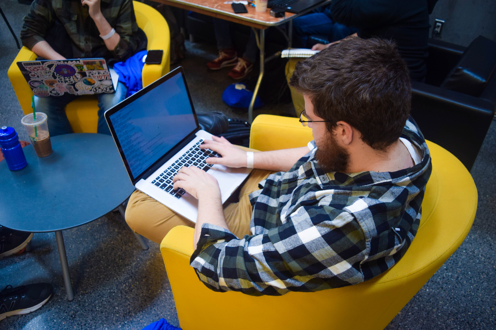

# BorrowIt


BorrowIt is a point-of-sales inspired inventory management solution for checking out and returning items. The Wentworth Hackathon Team came up with idea when evaluating our own Hackathon event, HackWITus. At our event, attendees are able to borrow hardware and tools to assist them in their hackathon projects. However, monitoring what is being rented out and to whom was difficult and required a messy excel spreadsheet. The implementation of BorrowIt doesn't just stop at Hackathons, but is applicable for many other scenarioes such as libraries, schools, and other form of rental services. 

BorrowIt is built as a progressive web application using React.js, Node.js, Fastify, and HarperDB. We are leverging HarperDB's quick hash-indexing database to store items, customers, and transactions. We have developed a standard REST API using Fastify and Node.js. Finally, the client is built using React.js and Bootstrap v4. 


# How to use this repository

We are following a mono-repo structure for this project. That means both the client and API are in this repository! Now even though this makes deployment a bit harder, it makes developing a lot easier for everyone else. 

Tip: Ensure that you `npm install` in the client directory, separately. If you do not independently `npm install` in the client directory it will not install the needed packages there at all. 

If you'd like to run both the client and the api at the same in one terminal you can use `npm run start-all`; alternatively you can run `npm run start-api` in one terminal tab and `npm run start-client` in another. You can also `cd` into one of the directories and run their standard start commands.

API: `npm run dev`
Client: `npm run start`

If you have any questions open an issue or reach out to one of the maintainers listed at the bottom!

# Contributing

### New contributors:
1. Fork repository and clone your fork locally using:

    ```
    git clone git@github.com:<YOUR-USERNAME>/borrowIt.git
    ```

    Don't forget to `cd borrowIt` after cloning.

2. Add the `upstream` repository using:

    ```
    git remote add upstream git@github.com:hackwitus/borrowIt.git
    ```

    Move on to the __Everybody__ section and continue on to step 3.

### Existing contributors: 
1. Navigate to your local clone of `borrowIt`. Checkout the master branch using: `git checkout master`
2. Then pull down any recent commits using: `git pull --rebase upstream master`. You should not have any merge conflicts because you should not be editing the master branch directly. 

    If you are trying to update a working branch: 
      1. Write down any commit hashes you want to keep
      2. Then: `git fetch upstream`
      3. Followed by: `git reset --hard upstream/master`
      4. Then for each of your commit hashes: `git cherry-pick <commit hash>`
      5. Finally: `git push -f`

### Everybody contributing:
3. Create a new branch with `git checkout -b branch-name`
4. Write your code and when your done run the following:

    ```
    git add .
    git commit -m 'Descriptive commit message'
    git push origin branch-name
    ```

    You have now pushed your _new code_ to __your__ repository. 

5. Navigate to the [`upstream`](https://github.com/hackwitus/borrowIt.git) repository and create a __new pull request__
6. If GitHub doesn't automatically select your new branch make sure to enable `compare across forks`
7. Enter a descriptive pull request name and description and 🎉 your code is now ready to be reviewed by another developer!

## Maintainers

🦉 [Ethan Arrowood](https://github.com/ethan-arrowood) _arrowoode@wit.edu_
